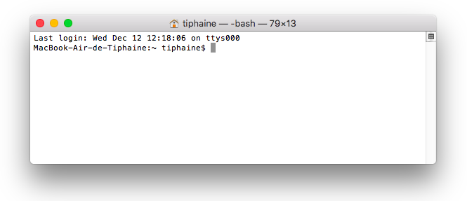
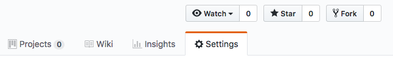
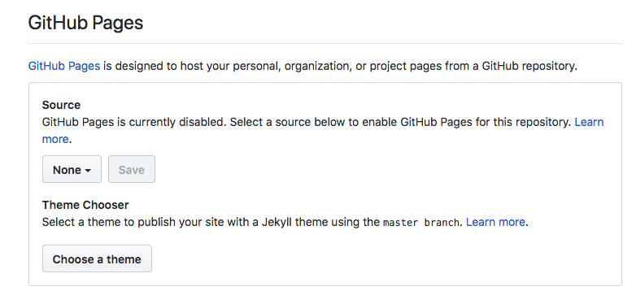
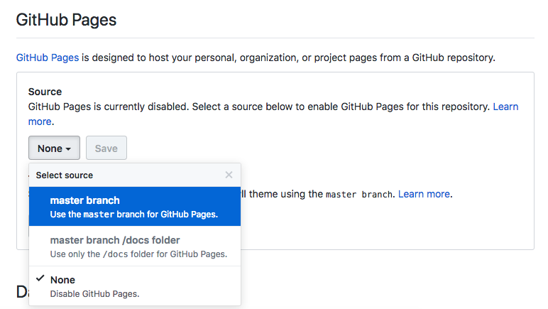
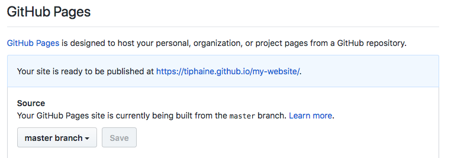
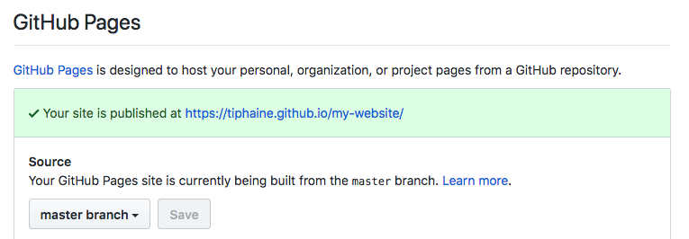
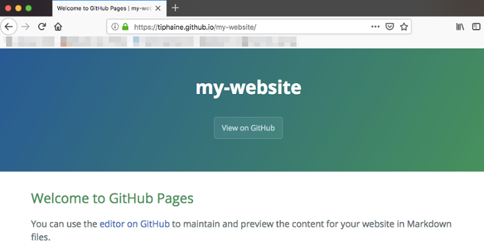

[Jekyll](https://jekyllrb.com/) is static site generator written in Ruby by Tom Preston-Werner. I used it for projects like [Prévisecours](https://tiphaine.github.io/previsecours.html) and realized that **static pages** and the **Markdown** syntax would allow me to blog more about my technical findings. So, I decided to move my homepage from Wordpress to Jekyll on Github pages with the [Sustain theme](https://github.com/jekyller/sustain).

Some would prefer [Hugo](https://gohugo.io/) but I'm more into Jekyll right now because of the [Github compatibility](https://help.github.com/articles/using-jekyll-as-a-static-site-generator-with-github-pages/) and the available themes.

One of Jekyll's main issue is installation, so here is how I made **Jekyll work on MAC OS High Sierra**.

### Jekyll installation

- Open a Terminal (Applications > Utilities > Terminal)

- Install xcode if you don't have it yet

		$ xcode-select --install

- Install [Homebrew](https://brew.sh/) (a free and open-source software package management system for macOS)
	
		$ /usr/bin/ruby -e "$(curl -fsSL https://raw.githubusercontent.com/Homebrew/install/master/install)"

- Run this script to install `ruby-build` and `rbenv` packages (I adapted it from [@DirtyF's](https://github.com/jekyll/jekyll/issues/6637) to get the latest `rbenv` version)

		$ bash setup-rbenv.sh
		

<pre><code> #!/bin/bash
	
set -ex
brew update
brew install rbenv ruby-build
rbenv install 2.5.3
rbenv global 2.5.3
ruby -v
gem install jekyll bundler
rbenv rehash
	
if ! type rbenv | grep function; then
  echo 'if which rbenv > /dev/null; then eval "$(rbenv init -)"; fi' >> ~/.bash_profile
fi
	
set +x
echo "Done! Close and reopen your terminal"
</code></pre>

Script code: [`setup-rbenv.sh`](https://gist.github.com/tiphaine/d3e53acbb1a20c0a102e20d0a5793d71)

- After, check your ruby install

		$ ruby -v
		ruby 2.5.3p105 (2018-10-18 revision 65156) [x86_64-darwin17]

- Install bundler and jekyll gems

		$ gem install jekyll bundler

- Check your jekyll version

		$ jekyll -v
		jekyll 3.8.5
		
You can now use jekyll on your local system.

### Run Jekyll to generate your static website

- Choose your own Jekyll theme and clone/unzip it on your computer (for example in the `my-website` directory):

		$ mkdir my-website
		$ cd my-website
		$ unzip chosen-jekyll-theme.zip
		$ bundle exec jekyll serve

- Your new local version of your new website should be up and running at this adress (copy paste it on your favorite browser): `http://localhost:4000`.

You can now customize and create content for your new site.

### Host it on Github pages

- To host your newly created website on Github, you just have to push the directory as a new repos using your favorite Github application our CLI.

- Go online on the Github repo to the Settings tab

- Go to the section below

- Select the `master branch` and Save

- You should get this

- Within a few minutes, reload the page and your site should be published

- Now you have your new page online ! Enjoy !

__Personal note__: I found this feature to be amazing for quickly putting up documentation about new projects and to spread them quickly around !

