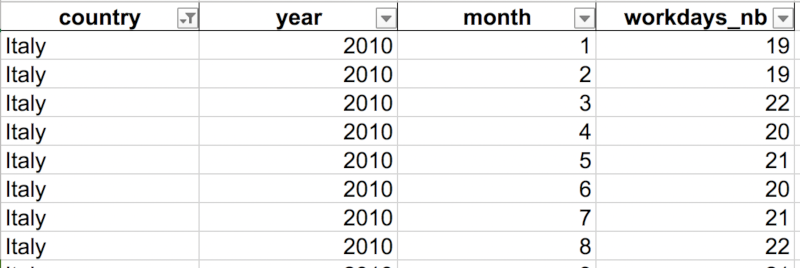

## TLDR 

A script to generate the number of working days per country per month for a specific year / [the repo](https://github.com/tiphaine/workdays-generator).

## Why business days ?

Have you ever worked with temporal data and wondered how people's daily lives impact these data? Like, how [bank holidays impacted the car sharing demand at Uber](https://eng.uber.com/neural-networks/)? How school days may have [impact on firemen calls](https://previsecours.fr) ? Or just understand if this temporal dimension has any impact at all on your data?

## How to get them ?

First things first, you have to get that calendar data per country for a long time range. I chose to focus in getting the number of business days per month because it seems to have a lot of impact on sales prediction for instance ;)

I also chose to generate a file based on a CLI with a given time range for a country per month. I aimed for reusability over integration in the product I was developing because I know that I'll need this feature again (and you too, if you are here :D). 

The current scope is:

- Generated workdays 

	- Europe: Austria, Belgium, Czech Republic, Denmark, France, Germany, Hungary, Ireland, Italy, Netherlands, Poland, Portugal, Romania, Russia, Slovenia, Spain, Sweden, Switzerland, United Kingdom.
	- Afrique: Algeria, Egypt, South Africa.
	- America: Brazil, Chile, Colombia, Mexico.
	- Asia: HongKong, Korea.


- Workalendar : available workday calendars

	- Europe: Austria, Belgium, Bulgaria, Catalonia, Croatia, Cyprus, Czech Republic, Denmark, Estonia, Finland, France, Germany, Greece, Hungary, Iceland, Ireland, Italy, Latvia, Lithuania, Luxembourg, Malta,  Netherlands, Norway, Poland, Portugal, Romania, Russia, Slovakia, Slovenia, Spain, Sweden, Switzerland, United Kingdom
	- Africa : Algeria, Angola, Benin, Ivory Coast, Madagascar, SaoTome And Principe, South Africa
	- Amérique: Brazil, Canada, Chile, Colombia, Mexico, Panama
	- Asia : Hong Kong, Japan, Malaysia, Qatar, Singapore, South Korea, Taiwan
	- Oceania : Australia


## Workdays generator

[Workdays Generator GitHub Repo](https://github.com/tiphaine/workdays-generator)


If you need to get an Excel file with the number of work days per month for a give country, this CLI may be for you. The workdays generator is based on the [`workalendar`](https://github.com/peopledoc/workalendar) package from `peopledoc`.

I am using it through a [virtualenv](https://virtualenv.pypa.io/en/latest/) in Python 3.7 and so should you !

### Installation

```
pip install -r requirement.txt
```

### Usage

```
Usage: generate_working_days.py [OPTIONS] FILENAME

Options:
  -y, --years TEXT  Required years (if void will generate 2010 to 2020).
  -z, --zones TEXT  Zone name in English [europe|africa|asia|america|oceania]
  --help            Show this message and exit.
```

Example

	python generate_working_days.py europe_workdays.xls -z europe
	
Generated output file where the columns are:

- `country`: country name in English
- `year`: year number
- `month`: month number
- `workdays_nb`: number of workdays

	


